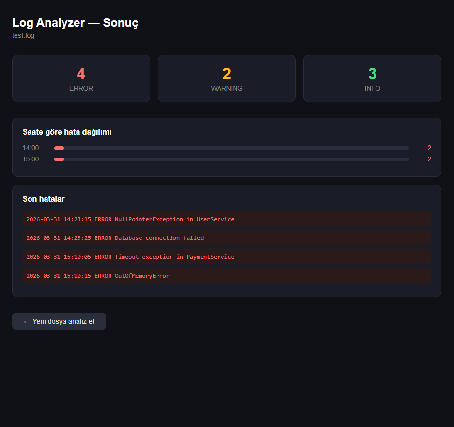

# Log Analyzer

A lightweight log file analyzer built with Spring Boot. Upload any `.log` or `.txt` file and instantly get a breakdown of errors, warnings, and info messages.

Inspired by enterprise log monitoring tools like [Volthread WLSDM](https://www.volthread.com/tr/urunler/wlsdm-weblogic-performans-izleme-cozumu/).

## Features

- Upload any log file (.log, .txt)
- Counts ERROR, WARNING, and INFO messages
- Shows hourly error distribution
- Lists the most recent errors
- Clean dark-themed dashboard

## Tech Stack

- Java 21
- Spring Boot 4.0.5
- Spring Web + Thymeleaf
- Maven

## How to run

### Prerequisites
- Java 21+
- Maven

### Run locally
```bash
./mvnw spring-boot:run
```

Then open your browser and go to:
```
http://localhost:8082
```

## Screenshot



## About

Built by **Ilayda Öztürk** as a portfolio project.  
Inspired by enterprise log monitoring and analysis solutions.
